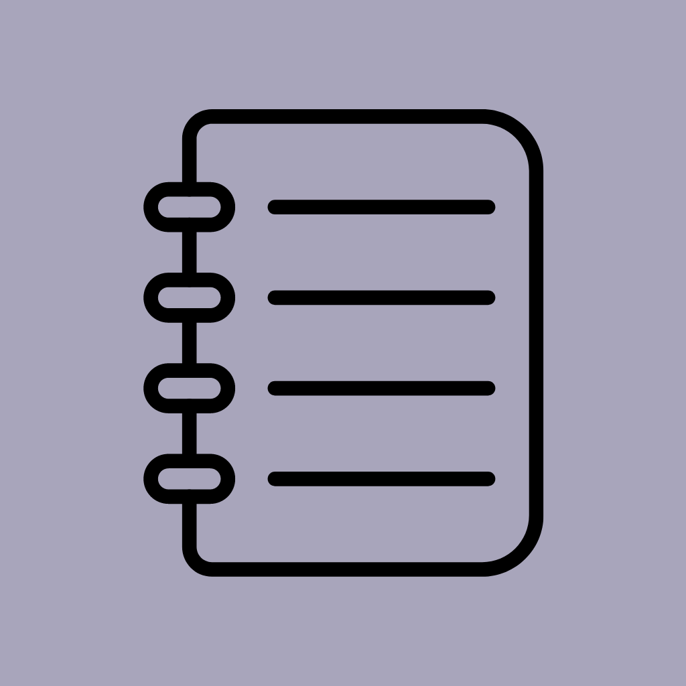

# QuickNotes - Kotlin Multiplatform Note App 

The QuickNotes app is a versatile mobile application built using Kotlin Multiplatform. It allows users to create, edit, and delete notes on both Android and iOS devices. The app offers a range of features to enhance the note-taking experience, including note color customization, note sorting, and note search capabilities. With the power of Kotlin Multiplatform, QuickNotes provides a seamless user experience across different platforms.

## Features

- **Create and Edit Notes**: Users can easily create new notes by providing a title and content. Existing notes can be edited to update the title or content as needed.

- **Delete Notes**: Unwanted notes can be effortlessly deleted, removing them from the app's storage.

- **Note Color Customization**: Users have the flexibility to personalize their notes by changing the color, allowing for better organization and visual distinction.

- **Note Sorting**: The app automatically sorts notes based on the time they were created or last edited, making it convenient to find the most recent or relevant notes.

- **Note Search**: Users can quickly search for specific notes by title or content, enabling them to locate the information they need efficiently.

---

Thank you for considering QuickNotes, the Kotlin Multiplatform Note App. It aims to simplify your note-taking process and enhance your productivity.
